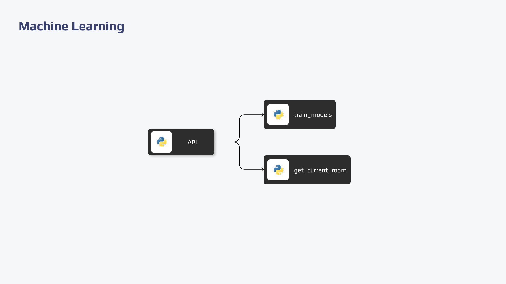

  

  

## Descrição

Este repositório envolve a criação e o gerenciamento de um modelo de Machine Learning que é acionado via API para realizar o treinamento e fazer previsões com base nos dados armazenados no MongoDB. O modelo é implantado no Cloud Run da Google Cloud Platform (GCP) e a implementação é automatizada usando GitHub Actions.

## Arquitetura

  

## Tecnologias
Essas tecnologias foram selecionadas para a aplicação com o objetivo de garantir alto desempenho,  eficiência e alta qualidade na aplicação.

